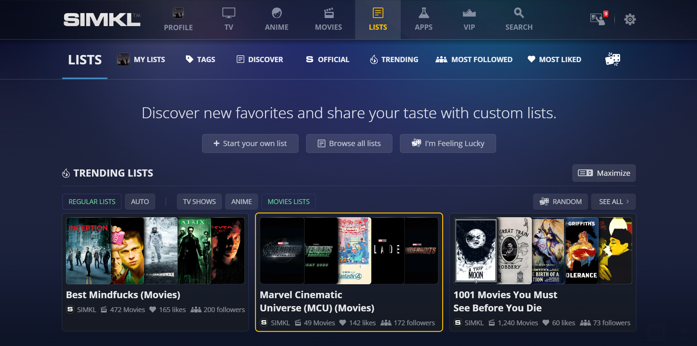
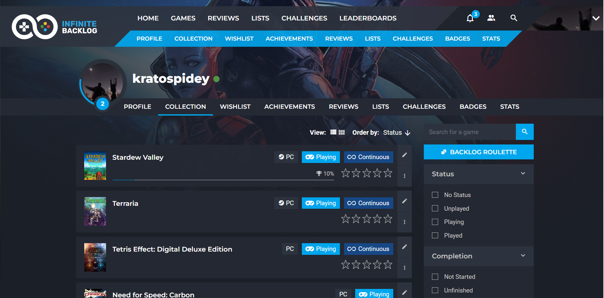

Tracking is a word I'm sure everyone is familiar with, we track a lot of stuff from our grades to our calories to our height but have y'all ever tracked your media consumption?
It might sound weird, "Why would I want to track something I do for leisure?" and other questions might be popping in your head, fret not I'll cover why all of the media I'm discussing 
should be tracked and how I track it personally.

# How I keep track of my movies & tv

I assume we all watch movies and tv, have you ever considered tracking the series and movies you watch?

Now the next obvious question, again should be, why?
Well put simply there a lot of reasons to do so, I'll provide a case of my own

There's this tv series called "Gossip Girl", I used to watch it in covid and absolutely enjoyed it however I got bored midway and stopped. Fast forward 4 years later and I want to resume it again but I can't remember where I stopped at all. So my options are 
1. Drop the series
2. Re-watch from start
3. start from somewhere random which you "think" is where you dropped it at
None of these are ideal options, i.e. being able to start exactly where I stopped. Having a list to track your progress, which you can refer to even years later, would solve this problem.

That's not all though, there are more reasons to track these, I'll cover a few more briefly

Let's say you track your watching  habits, over time you get a better idea of the kind of shows or movies you like so you can gauge better if a new show/movie is worth your time. Not just that, if it's a decent tracker, they will have some sort of algorithm which will even recommend you more shows based on what you tracked and liked in the past.

There's even more reasons though, in the modern age we're plagued w choices and personally I freeze up and can't decide at all if I have too many options, if I just tracked what shows I want to actually watch since before then I easily know what next to watch instead of spending hours scrolling Netflix only to put my comfort show on for the 100th time.

By tracking your movies and TV shows, you not only save time but also enhance your overall viewing experience. Whether it’s finding the perfect next show or remembering exactly where you left off, tracking makes your media consumption more intentional and enjoyable.

These all reasons plus even more make tracking your tv/movie consumption pretty useful but how do you track it?

I looked at a few options and in my opinion the best option is this website called [simkl](https://simkl.com)

Here's why, it not only supports tv series and movies but also anime (Japanese animated works)

It has inbuilt recommendation system which looks at what you watched and like before and recommends you newer stuff. 

It has a "latest shows you haven't watched yet" so you can easily catch up on any show you were holding off on.

It has a calendar feature which allows you to see what stuff is releasing on which day, with various options of full calendar, my calendar containing your shows and movies, premiere calendar containing premieres

That's not all though, it has lists which allows you to create new lists of various genre or topics that you can easily share with others.

There's also the concept of tag, essentially each show or film you watched has a set of tags and all of them appear here. This pretty much allows you to browse through tags of shows you like at once and select any you find interesting.

There's also of course "My Stats" which lets you see how much time you've spent watching content in general and other stuff. (It show's such immense time spent watching last week since I added all of these recently)

These aren't even all features, there are dedicated section to anime, movies and tv shows with list of what are best of those, upcoming works and more.

One feature which I personally love is the lists feature, this allows you to browse publicly shared lists.

In a world with endless content options, having a reliable way to track your viewing habits can make all the difference. Simkl offers an easy and efficient way to keep your film/tv consumption organized and enjoyable. Whether you're a casual viewer or a dedicated binge-watcher, it's definitely worth checking out.

# How I keep track of my music

At first, tracking your music might seem a bit unusual—after all, isn't music just something you listen to in the moment?
Media like books or games still make sense but music? 

Well surprisingly not only is it pretty easy to keep track of your music it's actually pretty convenient! There are multiple music tracking services out there like discog, musicboard, etc. but the one I would personally recommend is [last.fm](https://last.fm)

It's pretty easy to track your music with last.fm provided you use Spotify or Apple Music or Tidal, just connect the two services in settings and last.fm will automatically pick up any music you listen from now on.

Now what are the advantages of tracking my music on last.fm? Quite a lot surprisingly!
First and foremost you can track how your music taste changes over time, what's your most listened to song for the week, month, year etc.

For example here's my weekly report:

As you can see it gives pretty interesting insights such as my top artist or my top new album and more.
There's also a monthly and yearly version which you can check out on your own!

Now this is not even my favorite feature of last.fm, I absolutely love it's recommendation system and it's my go to for discovering new artists/band

For example I was recommended the above band since I've listened to similar music in the past and turns out Hippo Campus has some banger music too so I'll def be listening to their works more in the future

The recommendation system is also pretty smart, let's say I am more interested in music similar to a particular band, I can just go to their page and click "listen to similar artists"

In the end, Last.fm is more than just a tracking tool—it's a gateway to discovering new music, understanding your listening habits, and connecting with others who share your tastes. If you love music as much as I do, it's definitely worth giving it a try.

It immediately creates a playlist of similar artists for me and I can peruse and check out any songs I like.
Oh but it doesn't stop there, no no, you can get even more in depth into this, what if I want to listen to a particular genre of music only? Guess what, you can do that too!

Dust is a favorite band of mine and I can check out easily what kind of genre music they played to find similar music by other bands/artists.

All of these features make last.fm genuinely one of the best ways to discover new genre and music.

Basically the more you use Last.fm, the better its recommendation system becomes. As your taste evolves, Last.fm adapts, offering more refined and accurate suggestions. You can even tweak your settings to prioritize certain genres or styles.

Oh and one another aspects of last.fm which I look forward to using in feature is the social aspect.
It essentially allows you to connect with your friend, see what they are listening to, how your music taste is compared to them, what all do you have in common and just have fun and enjoy music together.

Sadly I have no friends on last.fm yet so I can't showcase this feature yet :(

Jokes aside, Last.fm has definitely helped me enjoy and discover new music a lot also see how my music taste evolves over the years and I can't wait to see what else is out there for me to listen and discover.

# How I keep track of my books

Before diving into how I track my books, let me share a bit of context about my lifelong love for reading, I've been into reading books since I was a kid, it's one of my favorite if not the most favorite hobbies. My dad got me into reading encyclopedias covering various topics as a kid and I received this book called "*Ask me anything*" as my 4th year birthday gift.

> [!caption] 
> 
> [Cover Source](https://www.google.co.in/books/edition/Ask_Me_Anything/O1upPQAACAAJ?hl=en)

Kid me was absolutely enamored by this book, I learnt about the origin of cosmos, the emergence of flaming giants we call stars to their untimely demise by going supernova or a white dwarf. I remember learning about animal kingdoms, how spiders aren't actually "*insects*" and even more.

Suffice to say this molded into a love for books in general since I was like 4 and since then it's been a constant presence in my life.

Over pandemic I started reading e-books since well it wasn't possible to avail physical books obviously.  One thing about e-books was that they were way more convenient to read heck I could even read them without any light, so I was practically reading day and night, this increased my reading speed and just amount of books I read by a lot but then slowly but surely pandemic ended and I had a random thought of "I wonder how many books I've read?" and then it struck me "Didn't I delete all the book files I downloaded once I was done reading 💀" so it was pretty hard for me to go back and see which all books I read in the past 2- 3 years but as I've learnt in life, there's always something positive you can learn and this thought me the importance of keeping track of books and in a larger theme media I'm consuming, whether it's purely for archival purposes or statistical purposes or even just something to look back upon and reminisce later at, regardless of your reason it's always good to log anything you do lest you want to regret it later.

After realizing the importance of tracking my reading, I explored a few options to track my books and discovered three that stood out:

1. [Goodreads](http://goodreads.com)
2. [Literal.club](https://literal.club/)
3. [StoryGraph](https://www.thestorygraph.com)

Goodreads is the de facto option that everyone uses, literal is sort of an underground option with a nice and clean UI which I personally loved the most but even after all of these I actually ended up going for the third option, here's why:
- Goodreads is owned by amazon and they are hardly doing any innovation or new stuff with their websites, it has barely changed over the years and has gotten stale
- literal while being a great option doesn't offer all the features that StoryGraph does

This pretty much primes the discussion for well what does StoryGraph do that differentiates it from the other two?
- Compared to Goodreads, StoryGraph is an independently owned free site so that's already a plus in my book cause I'd rather not support corporate capitalism if possible.

Now comes the main distinguishing factor and one that inspired the name "*StoryGraph*", it analyzes your book data and gives your various insights. It tracks various factors of the book you're reading and generates data driven insights such as "page count", "mood", "pace" etc. This data driven insight approached was the nail in the coffin for Goodreads and Literal for me.

So for example I'll share my stats for 2023 below (it shows average time to read as 1 day since I forgot to enter start day, it took me around 3 days per book)

Just cause of this it practically makes it way more worth it than Goodreads or even literal
StoryGraph also has other features such as lists, to read pile etc. and an in-depth option of writing reviews where you can specific themes, trigger warnings, etc. which I found really neat.

StoryGraph also has a feature which shows your last year wrapped, like a Spotify wrapped but for books:

There are a lot more other features which I haven't explored yet such as 

based on your reading preferences and other factors

All in all StoryGraph is a way better and neater tool for tracking books compared to Goodreads and I can't wait to see what my stats and insights are for 2024!

Also this just covers keeping track of my books, I have a different system in place for managing my e-books and sending them to my e-reader which I'll be covering in depth later.

# How I keep track of my games

"Why should I track my games and play it? That sounds so cumbersome!" is what I thought and honestly past me was totally valid to think that. I can barely make time to play games without feeling guilty (even though games are my hobby and a way of relaxation but I still feel guilty, that's a topic I wanna look more into later some day)

So, why bother tracking games at all? As it turns out, it’s actually quite useful.
Consider the below scenario
you meet someone new and you both hit off, conversation is flowing and you are learning about each other. They suddenly mention "hey I occasionally play video games" and you're like "No way? I'm into them too!" but then you suddenly forget every single gamer you've played 💀 so you can't talk about it at all.

Sounds a bit exaggerated but it has happened with me before, often when put on spot my mind just kind of blanks and I become a mumbling meat bag (putting it nicely) and then I'm like "only if I had a list of every game I've ever played so I could easily share it and we could talk about common games"

Well wouldn't you know, that's exactly that I'm writing about here! Anywho, being easily able to share your list with someone when needed is only one of the many advantages of tracking your video games.

Here are a few other:

## Being Organized

It has happened with me before when I'm playing a game and I take a break for a week or two cause of xyz reasons, that's alright but then I forget which game I was playing, which game I finished etc. It's really annoying going through my library and being like "did I finish this? did I not?"

That's not all though, sometimes I procrastinate on playing games (I know, procrastinating on something so simple and enjoyable as video games is wild but I somehow still do it)
having a proper list helps remind me of the games I’ve procrastinated on, which is surprisingly motivating.

One another genuinely bad habit of mine is sometimes I just forget to ever play a game, I'll see this new game that came out and I'll be like "Oh yes I'll def check that out in the future, let me save this post".

I never check it out in the future 💀 so having an actual list of games I will play makes me conscious of the fact that there are a lot of un-played games which I can't just ignore and encourages for me to be more picky over what I play considering I only have 24 hours like everyone else

## Tracking my progress

I can't explain it but it's really satisfying to see your progress in something whether it's a book or a game or heck even some sort of project go higher. With games I can see how my taste in games has changed over times, when I had "phases" of playing games of a certain genre, how many games I've played etc.

With this not only could you have a better idea if a certain game matches your history of playing past games you can also try games of genre you've never touched before just to expand your horizons.

This is also helpful just for the sake of well tracking when I played what game, I've had this occur like a million time at this point but I'll be talking with a friend, they mention a game and I'm like "oh yeah I remember playing that game" but I for the love of my life can't recall when I played it all.
It's really annoying, it's like an itch which no matter how much you scratch doesn't go away.

Anyway all of that yapping session aside 🤓, now that we know why I should track my games the elephant in the room (that's such a weird phrase, if there was an elephant in my room, it would literally fall apart) being How does anyone track their games?

Luckily for you ladies and men with gentle hands this is where my profound knowledge comes into play.

I was lying, it does not but I did scour the internet for this and the best option that fit my needs was [infinite backlog](https://infinitebacklog.net)

So contrary to the name, infinite backlog is in fact well not "infinite backlog" if anything it's "anti infinite backlog". They really aren't getting award for the best suitable name anytime soon 💀. Anyway so what IB (short for infinite backlog) actually is basically this website where you can track your games, it allows you to basically add any game you want, where you got it from (physical, digital, piracy) and a lot of other options

In fact I'm a believer of a picture is worth a thousand words so let me just show it.

Here I'm search for the game I want to add i.e. tetris effect, on the left there are various filters like game category, platform the game is on, genre, game modes, themes, player perspective, etc.

The game I want to add is the first result so I just click on the plus icon

Now I'm greeted with various menus

On the most right I can select my edition if I own the deluxe edition of the game, for the platform I will select PC since that's my platform
Now in ownership there's a lot of options, I pirate most of my games so I'll select "Unlicensed"
In Format it will be Digital

Now we scroll down and guess what? More menus (no shit sherlock)

Here I'll select playing and continuous cause well you can never really beat tetris (Unless you're that one 13 year old kid)

Now if you scroll down, you'll be greeted with more menus, I know, who would've guessed.
Jokes aside, these menus are pretty important 

Here you can write how long it took you to complete a game if you've already finished it and what was your overall rating etc.

Since this is Tetris and I suck at it we'll skip it. I'll just click Add to Collection and that's it!
Pretty much that easy to add something to your collection and track

If I go to my profile you can see it being reflected

Now this is all fun but the observant ones among you would notice that the website has a lot more tabs?

Well guess what, there's a lot more you can do, sadly it's impossible me to cover literally everything present here but trust me it's a lot and it's amazing however here's a quick overview of the other tabs:

- Wishlist -> Any games you want to buy in future
- Achievements -> Games have their own achievements and if you connect your steam account they will be shown on the website in your profile
- Reviews -> If you want to bring out the inner pretentious connoisseur of games in you, this is the tab for you.
- Lists -> As the name would imply, allows you to create lists of games, I used this to create a list of games which can run on most modern pcs since none of my friends have a gaming pc and then I just shared the list so they could browse through it and pick whatever game they like.
- Challenges -> There are a lot of challenges in gaming community, from speed runs to nuzlocks to what not, it's not possible for me to explain all of them but if you attempted any challenges for a game you can track them here.
- Badges -> Displays any badges you earned
- Stats -> my favorite page, shows a lot of statistics regarding how you play games and such.

Here's my stats page:

and that's pretty much it in short, the website has a lot more to offer and it really helps me to track my games so consider checking it out!

So now in all I've covered and explained why it's important to track all your media consumptions for various reasons, we are living in the age of information, there's so much to watch and consume so be mindful of what you consume and make sure you track it.

# Conclusion

In and all, tracking is a pretty vital and not to sound "nerdy" pretty cool thing everyone should do, I believe everyone has some sort of benefit from tracking their media consumption however those benefits can vary from person to personalbar.
Hope this blog was actually helpful and didn't sound too boring or bland. I recommend for you to discover this stuff and look a few other alternatives I mentioned and choose the one that best fits **your** needs.
